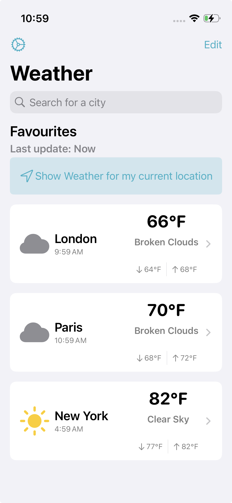
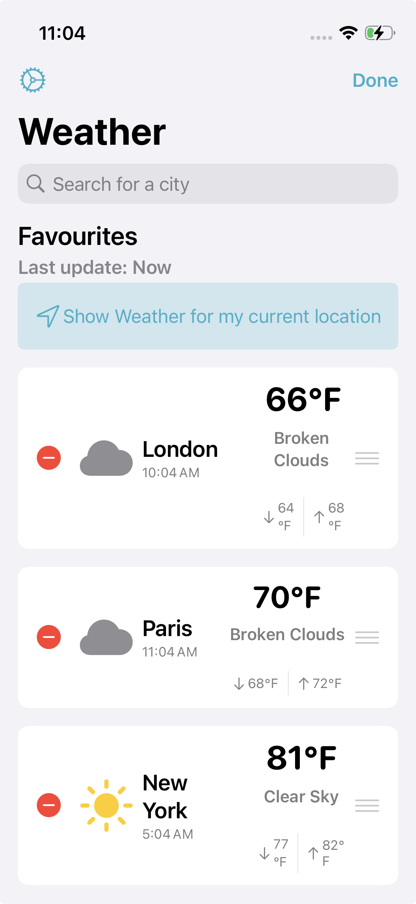
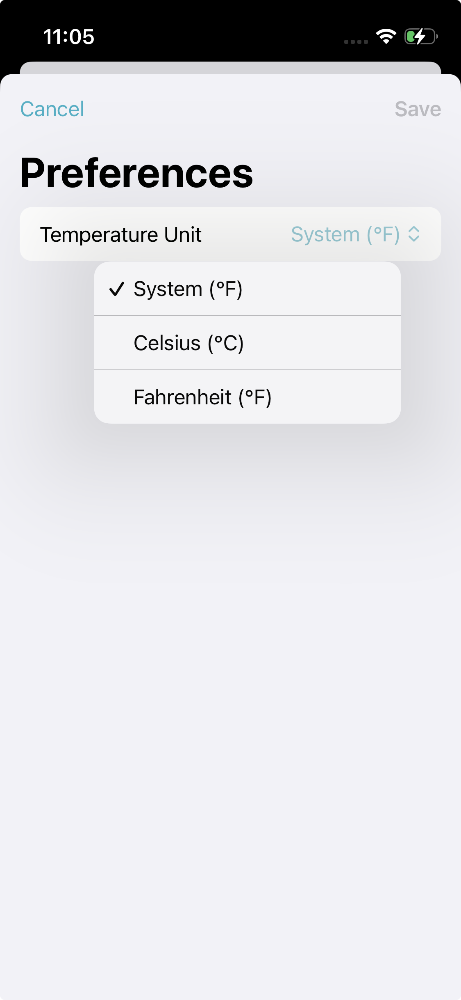
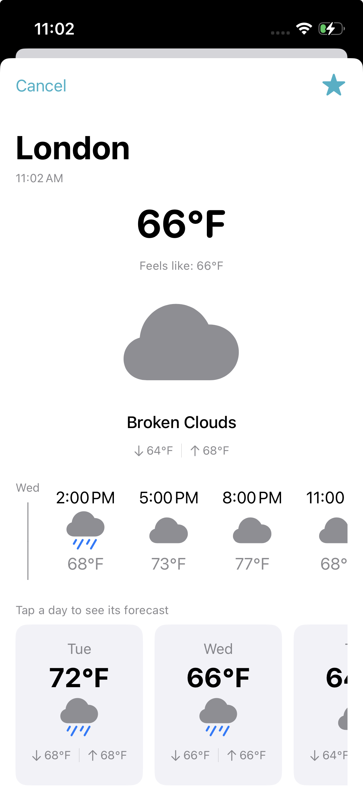
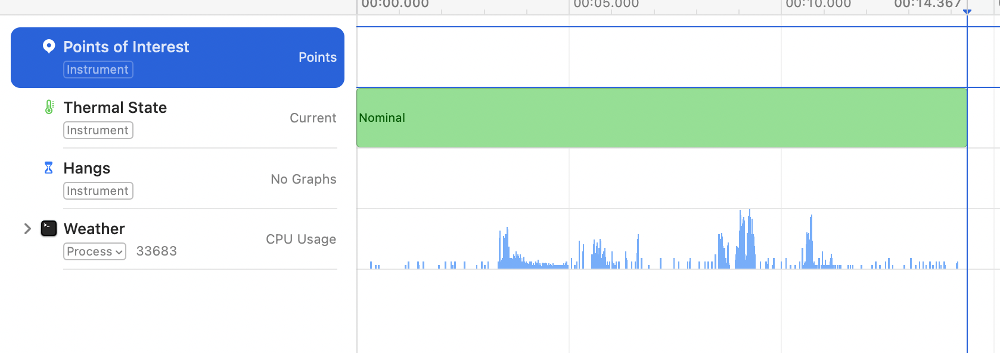

# 🌦️ Weather

A small weather app built with UIKit and SwiftUI, using [https://openweathermap.org/api](OpenWeatherMap) free-tier API.

<table>
  <tr>
    <td></td>
    <td></td>
    <td></td>
    <td></td>
  </tr>
</table>

## ❗️ Important - Security

When launching the app, you will be prompted by a message asking you to enter your OpenWeatherMap API Key in the user-defined build settings.

Xcode's environment values could have been used, but we lose them as soon as we detach the debugger, which is not very convenient here.

<b>You can get a free one here: https://home.openweathermap.org/api_keys</b>

## Requirements

📱 iOS 16+, iOS or iPadOS

## Features

❤️ Feature-rich favourites view in UIKit, with swipe actions, list reordering, peek-and-pop gestures and UISearchController

⛈️ SwiftUI forecast view, taking advantage of modern APIs and animations, such as ScrollViewReader

📍 The user can display the weather in it's current location

📏 Possibility to change unit between °C and °F, or use the preferred system option

♿️ Accessibility in mind

## Tech

🖼️ Modern UIKit techniques (DiffableDataSource, CompositionalLayout...)

🎨 Mixing SwiftUI and UIKit with performance in mind (UIHostingConfiguration for collection views...)

## Performance

When searching a city, displaying the forecast and adding it as a favourite, there is no hangs:

## Possible improvements

- Add Widgets, or even a watchOS app displaying the favourites, with a complication
- Add other languages, even though the app gets some localized strings for free (DateFormatter, MeasurementFormatter, AM/PM - 24h dates...)